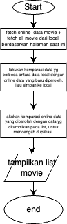
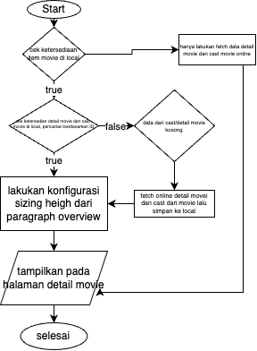

# ``movie project documentation``

this is documentation for movie project documentation

## Overview

berikut ini adalah dokumentasi dari project app List Movie. 
API dan data yang digunakan/ditampilkan bersumber dari: https://developers.themoviedb.org/3

API key dan API read access token dapa dilihat pada project setting

## User Guidance

- pull up tabel untuk mekalukan refresh list movie

- pull down/scroll kebawah tabel untuk memuat item movie lainnya

- ketika lakukan search, tekan tombol "Cari" pada keyboard untuk memperoleh item movie berdasarkan kata kunci, untuk memuat item movie berdasarkan kata kunci lainnya dapat lakukan pull down/scroll kebawah

- untuk reset pencarian dapat lakukan dengan hapus kata kunci laluk tekan tombol "Cari" pada keyboard

## Flowshart

- proses konfigurasi saat app pertama kali masuk (img: fist configure.png)

- proses fetch/refetch halaman (img: fetch data.png)

- poses load data detail movie dan cast (img: flow display informasi detail movie dan cast movie.png)

